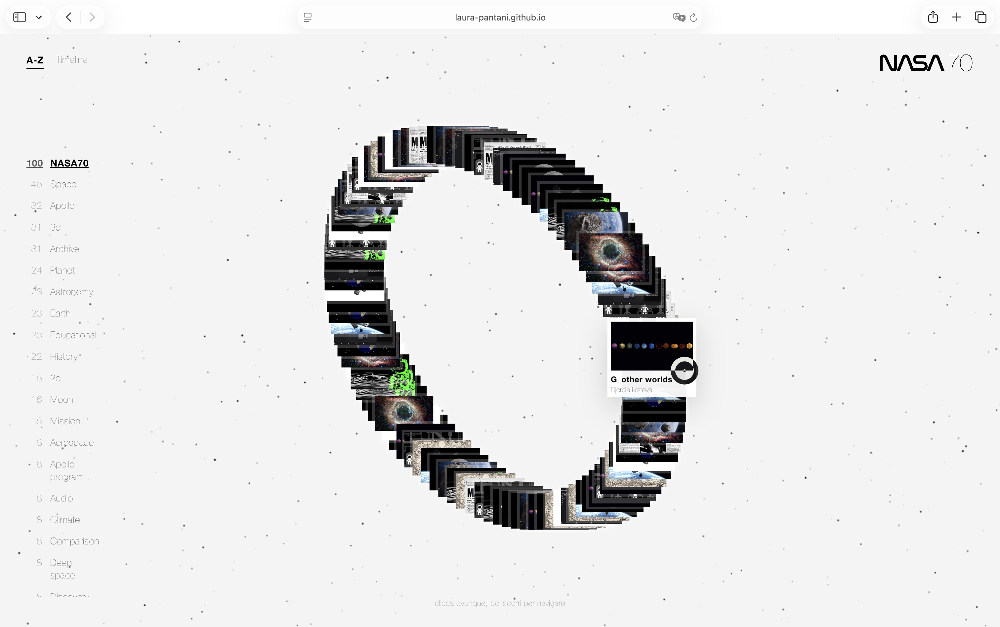
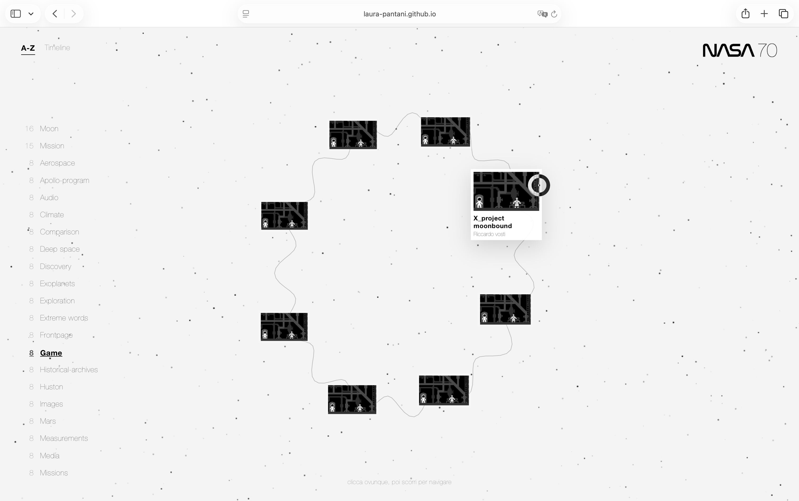

# NASA-Progetto 2
Pagina di lancio dei progetti fatti in classe.

# NASA70
Autore: Laura Pantani \
[NASA70](https://laura-pantani.github.io/NASA-P2/)

## Intenzioni progetto
la mia intenzione per questo progetto e di creare un archivio nello spazio dove i progetti orbitano attorno al Logo di NASA70. 
L'intenzione del progetto è creare un archivio digitale ispirato allo spazio, in cui i progetti della classe orbitano attorno al titolo NASA70. L'interfaccia non è pensata come una semplice lista, ma come un sistema visivo in movimento: ogni progetto diventa una piccola card nello spazio, simile a un satellite o a un corpo celeste.
L'idea principale è rendere l'esplorazione dei progetti più libera e curiosa. L'utente può osservare l'orbita generale, filtrare i contenuti attraverso i tag e aprire le card per scoprire maggiori informazioni sul singolo progetto.

## Tag e animazioni
I tag sono stati pensati come un modo per dare ordine all'archivio, ma anche per modificare il comportamento visivo della pagina. Quando si seleziona un tag, cambiano sia i progetti mostrati sia il tipo di movimento orbitale. 
Per alcuni tag l'animazione è collegata al significato del tag stesso. Ad esempio, il tag 2D genera un'orbita più piatta e frontale, mentre il tag 3D crea un movimento con maggiore profondità e prospettiva. Altri tag più generici, come history, Apollo o space, mantengono invece l'animazione classica di NASA70, perché non hanno una forma visiva specifica abbastanza forte da richiedere un movimento dedicato.
Anche il testo centrale cambia in base al tag selezionato, con un effetto "matrix" che rende il passaggio da una categoria all'altra più dinamico. Le card laterali nella modale seguono il tag attivo, così l'utente vede progetti collegati al contesto che sta esplorando.

## Target
Il progetto è pensato principalmente per studenti, docenti e visitatori interessati a scoprire i lavori realizzati per NASA70. Il target include persone che vogliono esplorare i progetti in modo rapido, ma anche utenti curiosi che preferiscono un'esperienza più immersiva e visiva rispetto a un archivio tradizionale.
L'obiettivo è rendere la consultazione accessibile, ma allo stesso tempo coerente con l'immaginario NASA: orbite, movimento, profondità e navigazione nello spazio diventano il linguaggio con cui raccontare i progetti.

## Processo Creativo e Schizzi
Il progetto è nato dalla volontà di trasformare un semplice elenco in un'esperienza immersiva. I primi schizzi si sono concentrati sulla meccanica dell'orbita: come tradurre i dati dei progetti in variabili matematiche (raggio, inclinazione e velocità) per creare un sistema che sembrasse vivo e dinamico.

*Studio iniziale delle traiettorie ellittiche: definizione della prospettiva 3D e della gerarchia visiva tra il nucleo centrale e i progetti orbitanti.*

*Progettazione dell'interfaccia: studio del posizionamento dei filtri laterali e della transizione verso la modalità Timeline per garantire un'usabilità chiara.*

## Interfaccia e Schermate
L'esperienza utente si articola in tre momenti principali, ognuno con una funzione specifica nella navigazione dell'archivio.

